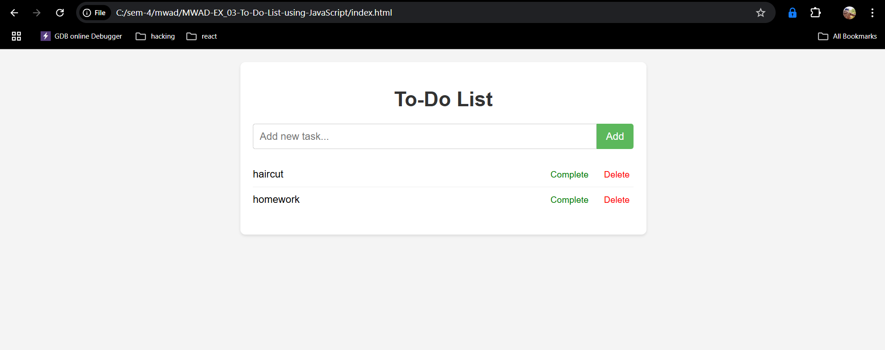

# MWAD-EX_03-To-Do-List-using-JavaScript
## Date:

## AIM
To create a To-do Application with all features using JavaScript.

## ALGORITHM
### STEP 1
Build the HTML structure (index.html).

### STEP 2
Style the App (style.css).

### STEP 3
Plan the features the To-Do App should have.

### STEP 4
Create a To-do application using Javascript.

### STEP 5
Add functionalities.

### STEP 6
Test the App.

### STEP 7
Open the HTML file in a browser to check layout and functionality.

### STEP 8
Fix styling issues and refine content placement.

### STEP 9
Deploy the website.

### STEP 10
Upload to GitHub Pages for free hosting.

## PROGRAM

## INDEX.HTML:
    '''
    <!DOCTYPE html>
    <html lang="en">
    <head>
        <meta charset="UTF-8">
        <meta name="viewport" content="width=device-width, initial-scale=1.0">
        <title>To-Do List</title>
        <link rel="stylesheet" href="style.css">
    </head>
    <body>
        

            <h1>To-Do List</h1>
            

                <input type="text" id="taskInput" placeholder="Add new task...">
                <button id="addTaskBtn">Add</button>
            

            <ul id="taskList">
                </ul>
        

        
    </body>
    </html>
'''
## STYLE.CSS:
    '''
    body {
    font-family: sans-serif;
    margin: 20px;
    background-color: #f4f4f4;
}

.container {
    max-width: 600px;
    margin: 0 auto;
    background-color: #fff;
    padding: 20px;
    border-radius: 8px;
    box-shadow: 0 2px 4px rgba(0, 0, 0, 0.1);
}

h1 {
    text-align: center;
    color: #333;
    margin-bottom: 20px;
}

.input-group {
    display: flex;
    margin-bottom: 20px;
}

#taskInput {
    flex-grow: 1;
    padding: 10px;
    border: 1px solid #ccc;
    border-radius: 4px 0 0 4px;
    font-size: 16px;
}

#addTaskBtn {
    background-color: #5cb85c;
    color: white;
    border: none;
    padding: 10px 15px;
    border-radius: 0 4px 4px 0;
    cursor: pointer;
    font-size: 16px;
}

#addTaskBtn:hover {
    background-color: #4cae4c;
}

#taskList {
    list-style-type: none;
    padding: 0;
}

#taskList li {
    display: flex;
    align-items: center;
    padding: 10px 0;
    border-bottom: 1px solid #eee;
}

#taskList li:last-child {
    border-bottom: none;
}

#taskList li span {
    flex-grow: 1;
    font-size: 16px;
}

#taskList li.completed span {
    text-decoration: line-through;
    color: #888;
}

.actions {
    margin-left: 15px;
}

.actions button {
    background: none;
    border: none;
    cursor: pointer;
    margin-left: 8px;
    font-size: 14px;
}

.actions .complete-btn {
    color: green;
}

.actions .delete-btn {
    color: red;
}

.actions button:hover {
    opacity: 0.8;
}
    
'''

## SCRIPT.JS:

'''
document.addEventListener('DOMContentLoaded', () => {
    const taskInput = document.getElementById('taskInput');
    const addTaskBtn = document.getElementById('addTaskBtn');
    const taskList = document.getElementById('taskList');

    let tasks = loadTasks();
    renderTasks();

    addTaskBtn.addEventListener('click', () => {
        const taskText = taskInput.value.trim();
        if (taskText !== '') {
            const newTask = {
                id: Date.now(),
                text: taskText,
                completed: false
            };
            tasks.push(newTask);
            saveTasks();
            renderTasks();
            taskInput.value = '';
        }
    });

    taskList.addEventListener('click', (event) => {
        const target = event.target;
        const listItem = target.closest('li');
        if (!listItem) return;

        const taskId = parseInt(listItem.dataset.taskId);

        if (target.classList.contains('complete-btn')) {
            toggleComplete(taskId);
        } else if (target.classList.contains('delete-btn')) {
            deleteTask(taskId);
        }
    });

    function renderTasks() {
        taskList.innerHTML = '';
        tasks.forEach(task => {
            const listItem = document.createElement('li');
            listItem.dataset.taskId = task.id;
            listItem.innerHTML = `
                ${task.text}
                

                    <button class="complete-btn">${task.completed ? 'Undo' : 'Complete'}</button>
                    <button class="delete-btn">Delete</button>
                

            `;
            taskList.appendChild(listItem);
        });
    }

    function toggleComplete(taskId) {
        tasks = tasks.map(task =>
            task.id === taskId ? { ...task, completed: !task.completed } : task
        );
        saveTasks();
        renderTasks();
    }

    function deleteTask(taskId) {
        tasks = tasks.filter(task => task.id !== taskId);
        saveTasks();
        renderTasks();
    }

    function saveTasks() {
        localStorage.setItem('tasks', JSON.stringify(tasks));
    }

    function loadTasks() {
        const storedTasks = localStorage.getItem('tasks');
        return storedTasks ? JSON.parse(storedTasks) : [];
    }
});
'''

## OUTPUT

## RESULT
The program for creating To-do list using JavaScript is executed successfully.
